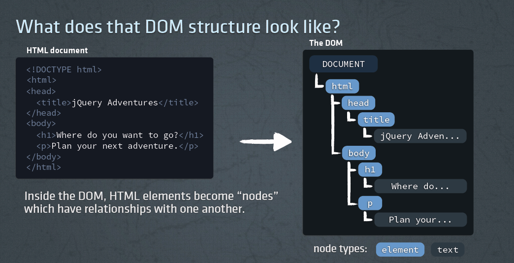

# Learning DOM (Document Object Model)

The HTML DOM model is constructed as a tree of Objects, created by the browser, so we can quickly find HTML elements using JavaScript

## My Learning

For quick revision: [Click here ](all-readme/main-readme.md)

Made a proper markdown in which I have mentioned all the things I have learnt while making this project.
