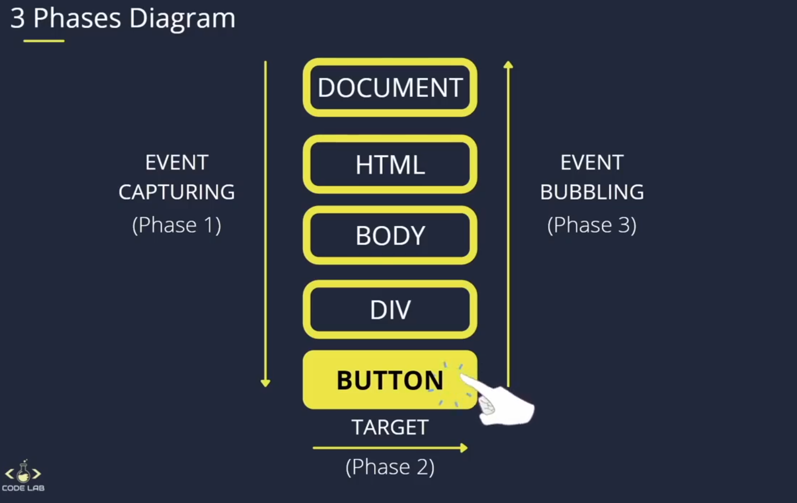
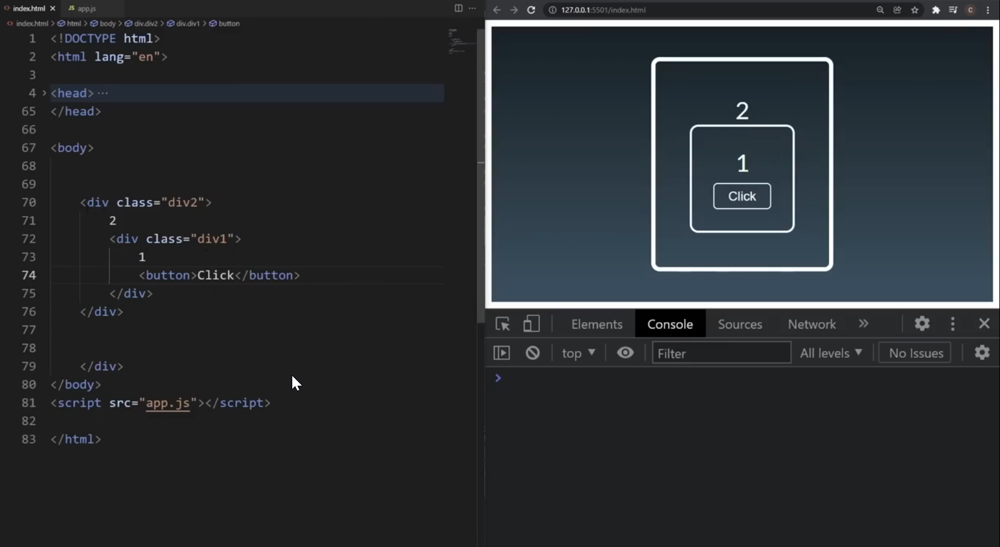

# Event Propagation

We will be learning three phases of it.

1. Event Capturing.
2. Target
3. Event Bubbling

## Phases Diagram



## Event Capturing

In event capturing we `start from root` and `go towards the target`. For activating the event capturing we give the `third parameter` of addEventListener to `true`

Here se the example of Html structure.



#### **we have added event listener in window, document, div2, div1 and the button**

```
window.addEventListener(
  "click",
  () => {
    console.log("window");
  },
  true
);

document.addEventListener(
  "click",
  () => {
    console.log("document");
  },
  true
);

document.querySelector(".div2").addEventListener(
  "click",
  () => {
    console.log("div 2");
  },
  true
);

document.querySelector(".div1").addEventListener(
  "click",
  () => {
    console.log("div 1");
  },
  true
);

document.querySelector("button").addEventListener(
  "click",
  (e) => {
    console.log((e));  -> It will show us all the event that we can use
    console.log((e.target)); -> using target event will show button element
    console.log((e.target.innerText = "clicked")); -> we can select the inner text of the button and change it.
  },
  true
);
```

**The output will be:**

```
window
document
div 2
div 1
clicked
```

## Event Bubbling

It ise same as event capturing but in this it will `start from the target` element `towards the root`. We have to change the `third parameter to false` instead of true

**The output will be:**

```
clicked
div 1
div 2
document
window
```

## Stop propagation

If in between we want to stop event propagation then we can use `e.stopPropagation()`

```
document.querySelector(".div1").addEventListener(
  "click",
  (e) => {
    e.stopPropagation()
    console.log("div 1");
  },
  true
);
```

So it will give output like this

```
window
document
div 2
div 1 -> it will stop at div one
```

## Once propagation

If we don't want to target an element while propagation so we can use `{once: true}`

```
document.querySelector(".div1").addEventListener(
  "click",
  (e) => {
    e.stopPropagation()
    console.log("div 1");
  },
  {once: true}
);
```

## Preventing Default

If we use `anchor` tag instead of `button` then it will `redirect` us somewhere else and this will `fire all the event capturing and refresh the page`. To prevent from this we use `e.preventDefault()`

```
document.querySelector(".button").addEventListener(
  "click",
  (e) => {
    e.preventDefault()
    console.log("button clicked");
  },
  {once: true}
);
```
